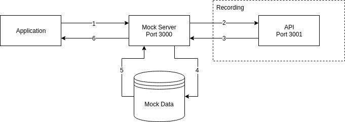

# Remok

Remok is a simple **re**cord and **re**play capable **mo**c**k** server.



## Features

* Records requests
* Replays recorded requests
* Small footprint (only two tiny dependencies)
* Works out of the box with zero config
* Uses a powerful hash logic to store mocks
* Written with future proof ECMAScript 2015 module syntax

## Installation

Remok is available as the `remok` package on [npm](https://www.npmjs.com/search?q=remok). 

```
npm install --save-dev remok
```

## How to use

### API

```js
const remok = require('remok');

const server = remok({
  server: {
    port: 3000,
  },
  mocks: {
    path: './mocks',
  },
  proxy: {
    target: 'https://some.api.tld',
  },
});

server.start();
```

### CLI

```bash
$ remok --config ./remok.config.js
```

```js
// remok.config.js
module.exports = {
  proxy: {
    target: 'https://some.api.tld',
  },
}
```

### Test

You can test your setup by sending a request to the server:
```sh
curl http://localhost:3000/some/endpoint
```

## Advanced usage

### Manually creating a mock

Remok will always try to load a `/path/to/mock/<METHOD>.@override.json` file first,
afterwards it searches for a `/path/to/mock/<METHOD>.<REQUEST_HASH>.json` file.

You can use the `remok create-mock ./foo/GET` CLI command in order to create a manual mock.

Activating the watch-mode `mocks.watch: true` will load new mocks without having to restart Remok.

### Mock file structure

The following fields are required in a mock file:

```json
{
  "time": "2018-01-01T00:00:00.000Z",
  "request": {
    "_hash": "requesthashvalue",
    "method": "GET",
    "path": "/foo/bar",
    "headers": {
      "key": "value"
    },
    "query": null,
    "body": null
  },
  "response": {
    "_hash": "responsehashvalue",
    "_time": null,
    "status": {
      "code": 201,
      "message": "custom status message"
    },
    "headers": {
      "key": "value"
    },
    "body": "I'm the response body!"
  }
}
```

### History mode

🚧

<!-- TODO Think about this idea:
Create a `.history.json` file in the mock directory
* Save call history for request hashes:
  /foo/bar/GET  => GET.hash123.responsehash123.json
  /foo/bar/GET  => GET.hash123.responsehash123.json
  /foo/bar/POST => POST.hash12.repsonsehashabc.json
  /foo/bar/GET  => GET.hash123.responsehash321.json
* Iterate history on requests
-->

## API

### remok(\[options\])

Creates the Remok application.
 
| Property         | Type       | Default            | Description                              |
| ---------------- | ---------- | ------------------ | ---------------------------------------- |
| `verbose`        | `boolean`  | `true`             | Makes output more or less verbose        |
|                  |            |                    |                                          |
| `server.port`    | `number`   | `3000`             | Server port                              |
| `server.host`    | `string`   | `localhost`        | Server host                              |
|                  |            |                    |                                          |
| `mocks.record`   | `mixed`    | `true`             | Whether to record mocks. Setting this option to `overwrite` will overwrite existing mocks. |
| `mocks.path`     | `string`   | `./remok`          | Path used for storing recorded mocks     |
| `mocks.history`🚧 | `boolean`  | `false`            | Use the history mode                     |
| `mocks.watch`    | `boolean`  | `false`            | Reloads all mocks on every request. Useful for developing with manual mocks. |
| `mocks.reqHash`  | `function` |                    | Callback; receives a `Request` object, should return a request hash |
| `mocks.resHash`  | `function` |                    | Callback; receives a `HttpResponse` object, Should return a response hash |
|                  |            |                    |                                          |
| `proxy.target`   | `string`   | `http://localhost` | The proxy target                         |
| `proxy.timeout`  | `number`   | `5000`             | Proxy request timeout in milliseconds    |

### remok.start() `async`

Starts the Remok server.

### remok.stop() `async`

Stops the Remok server.

### remok.use(\[path,\] callback) 🚧

Mounts the specified middleware for the specified path.

| Property          | Type      | Description                       |
| ----------------- | --------- | --------------------------------- |
| `path`            | `string`  | Route path.                       |
| `callback`        | `mixed`   | Callback; can be: A middleware function. A class with a `invoke()` method. |

### remok.useProxy(\[path,\] callback) 🚧

Mounts the specified proxy middleware for the specified path.

| Property          | Type      | Description                       |
| ----------------- | --------- | --------------------------------- |
| `path`            | `string`  | Route path.                       |
| `callback`        | `mixed`   | Callback; can be: A middleware function. A class with a `invoke()` method. |


## FAQ

### Why does Remok create a new mock on every request, even if the request is always the same?

In order to detect new requests, Remok calculates hashes based on the request and response data.

Please make sure to exclude request and response headers that change on every request.

In this example, body and headers are not used for calculating the hash:
```js
// Calculates a SHA256 hash. You can use any other hash function.
const hash = require('remok/dist/hash');

remok({
  mocks: {
    requestHash: (Request) => hash(Request.method + Request.url),
  },
})
```

### How can I handle different data on subsequent requests?

🚧

### I have multiple test scenarios with endpoints responding with distinct data. How can I setup those scenarios?

You can setup scenarios by running Remok with a scenario-specific mock path:
```js
// Scenario A
remok({
  mocks: {
    path: './mocks/scenario-a',
  }
});
// Scenario B
remok({
  mocks: {
    path: './mocks/scenario-b',
  }
});
```

## Planned features

* Middlewares
* History mode
* Record proxy response time

## License

Remok is licensed under the MIT License - see the `LICENSE` file for details.
